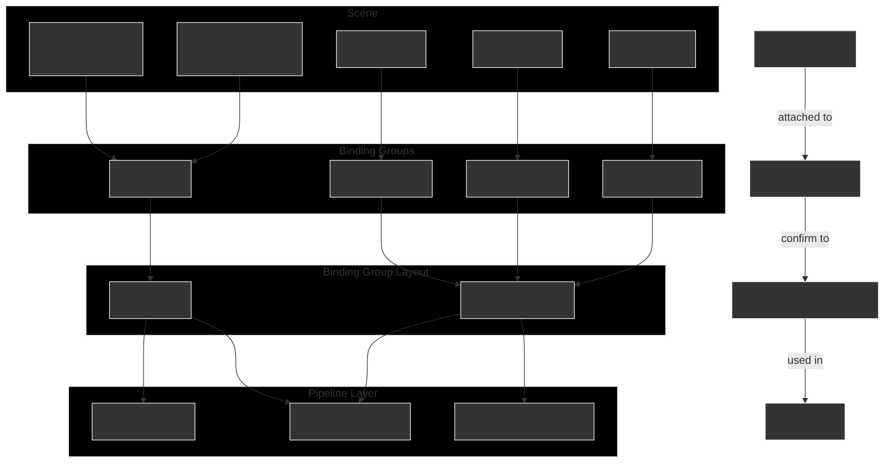

```mermaid
graph TD;

    MainA[Scene Entity]
    MainB[Binging Group]
    MainC[Binging Group Layout]
    MainD[Pipeline]

    MainA -->|attached to| MainB
    MainB -->|confirm to| MainC
    MainC -->|used in| MainD
    
%% Layer 1: Scene Entity
    subgraph Layer1[Scene]
    
       
        BindGroupA[view/proj. \n uniforms buffer]
        BindGroupB[models transform \n buffer]
        BindGroupC[texture #1]
        BindGroupD[texture #2]
        BindGroupE[texture ...]
    end

%% Layer 2: Binding Groups
    subgraph Layer2[Binding Groups]
  
       
        BindGroupAlpha[per form]
        BindGroupBeta[per Entity #1]
        BindGroupGamma[per Entity #2]
        BindGroupDelta[per Entity ...]
    end

%% Layer 3: Binding Group Layouts
    subgraph Layer3[Binding Group Layout]
       
        LayoutAlpha[per form]
        LayoutBeta[per Entity Type]
    end

%% Layer 4: Pipeline/Shaders
    subgraph Layer4[Pipeline Layer]
        ShaderA[basic shader]
        ShaderB[fragment shader]
        ShaderC[post process shader]
    end

%% Binding group connections
    BindGroupA --> BindGroupAlpha
    BindGroupB --> BindGroupAlpha
    BindGroupC --> BindGroupBeta
    BindGroupD --> BindGroupGamma
    BindGroupE --> BindGroupDelta

%% Layout connections
    BindGroupAlpha --> LayoutAlpha
    BindGroupBeta --> LayoutBeta
    BindGroupGamma --> LayoutBeta
    BindGroupDelta --> LayoutBeta

%% Shader connections
    LayoutAlpha --> ShaderA
    LayoutAlpha --> ShaderB
    LayoutBeta --> ShaderB
    LayoutBeta --> ShaderC

%% Style definitions
classDef default fill:#333,stroke:#f9f9f9,stroke-width:1px
classDef layerStyle fill:#000000,stroke:#f9f9f9,stroke-width:2px
class Layer1,Layer2,Layer3,Layer4 layerStyle
```