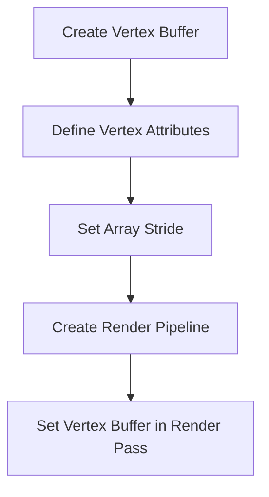
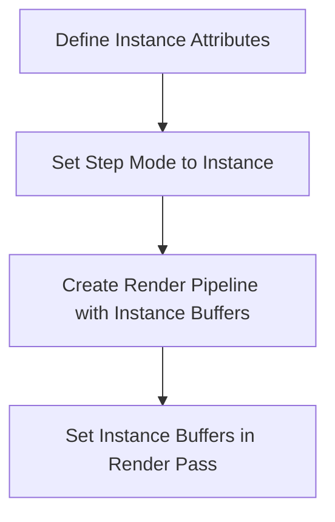
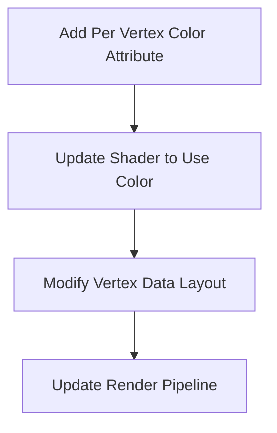
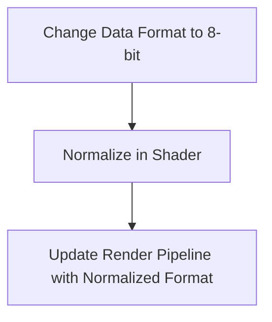
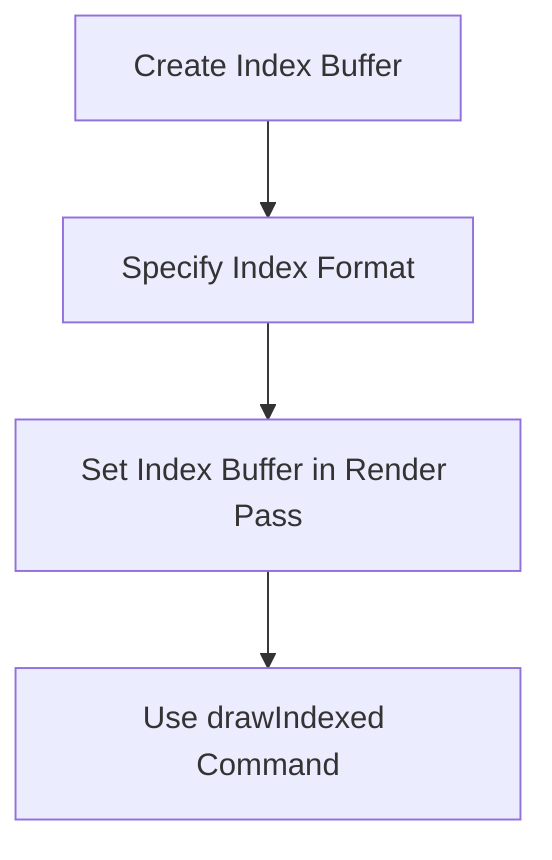
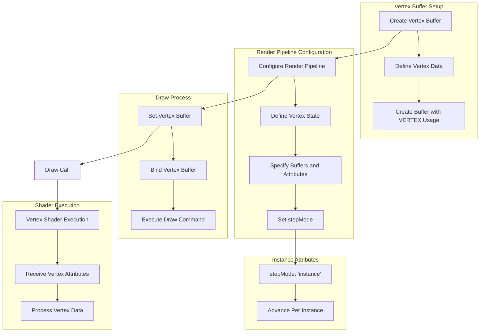

# WebGPU Vertex Buffers

## Overview

This document provides a detailed explanation of how to use vertex buffers in WebGPU to pass vertex data to shaders. It covers the transition from using storage buffers to vertex buffers, setting up render pipelines, and utilizing index buffers for efficient vertex processing.

## Table of Contents

1. [Vertex Buffers](#vertex-buffers)
2. [Instancing with Vertex Buffers](#instancing-with-vertex-buffers)
3. [Per Vertex Color](#per-vertex-color)
4. [Normalized Attributes](#normalized-attributes)
5. [Index Buffers](#index-buffers)

## Vertex Buffers

Vertex buffers are used to store vertex data and provide it to the vertex shader. Unlike storage buffers, vertex buffers are accessed indirectly by specifying the data layout and attributes in the render pipeline.

### Vertex Buffer Setup



### Code Example

```js
const vertexBuffer = device.createBuffer({
    label: 'vertex buffer vertices',
    size: vertexData.byteLength,
    usage: GPUBufferUsage.VERTEX | GPUBufferUsage.COPY_DST,
});
device.queue.writeBuffer(vertexBuffer, 0, vertexData);

const pipeline = device.createRenderPipeline({
    label: 'vertex buffer pipeline',
    layout: 'auto',
    vertex: {
        module,
        buffers: [
            {
                arrayStride: 2 * 4, // 2 floats, 4 bytes each
                attributes: [
                    {shaderLocation: 0, offset: 0, format: 'float32x2'}, // position
                ],
            },
        ],
    },
    fragment: {
        module,
        targets: [{ format: presentationFormat }],
    },
});
```

## Instancing with Vertex Buffers

Instancing allows attributes to advance per instance rather than per vertex, enabling efficient rendering of multiple instances of geometry.

### Instancing Setup



### Code Example

```js
const pipeline = device.createRenderPipeline({
    label: 'flat colors',
    layout: 'auto',
    vertex: {
        module,
        buffers: [
            {
                arrayStride: 2 * 4, // 2 floats, 4 bytes each
                attributes: [
                    {shaderLocation: 0, offset: 0, format: 'float32x2'}, // position
                ],
            },
            {
                arrayStride: 6 * 4, // 6 floats, 4 bytes each
                stepMode: 'instance',
                attributes: [
                    {shaderLocation: 1, offset: 0, format: 'float32x4'}, // color
                    {shaderLocation: 2, offset: 16, format: 'float32x2'}, // offset
                ],
            },
        ],
    },
    fragment: {
        module,
        targets: [{ format: presentationFormat }],
    },
});
```

## Per Vertex Color

Adding per vertex color involves interleaving color data with position data and updating the shader to use this color information.

### Per Vertex Color Setup



### Code Example

```js
const pipeline = device.createRenderPipeline({
    label: 'per vertex color',
    layout: 'auto',
    vertex: {
        module,
        buffers: [
            {
                arrayStride: 5 * 4, // 5 floats, 4 bytes each
                attributes: [
                    {shaderLocation: 0, offset: 0, format: 'float32x2'}, // position
                    {shaderLocation: 4, offset: 8, format: 'float32x3'}, // perVertexColor
                ],
            },
        ],
    },
    fragment: {
        module,
        targets: [{ format: presentationFormat }],
    },
});
```

## Normalized Attributes

Using normalized attributes can save space by storing data in smaller formats and normalizing them in the shader.

### Normalized Attributes Setup



### Code Example

```js
const pipeline = device.createRenderPipeline({
    label: 'per vertex color',
    layout: 'auto',
    vertex: {
        module,
        buffers: [
            {
                arrayStride: 2 * 4 + 4, // 2 floats, 4 bytes each + 4 bytes
                attributes: [
                    {shaderLocation: 0, offset: 0, format: 'float32x2'}, // position
                    {shaderLocation: 4, offset: 8, format: 'unorm8x4'}, // perVertexColor
                ],
            },
        ],
    },
    fragment: {
        module,
        targets: [{ format: presentationFormat }],
    },
});
```

## Index Buffers

Index buffers allow reusing vertices by specifying the order in which vertices are processed, reducing redundancy and improving performance.

### Index Buffer Setup



### Code Example

```js
const indexBuffer = device.createBuffer({
    label: 'index buffer',
    size: indexData.byteLength,
    usage: GPUBufferUsage.INDEX | GPUBufferUsage.COPY_DST,
});
device.queue.writeBuffer(indexBuffer, 0, indexData);

pass.setIndexBuffer(indexBuffer, 'uint32');
pass.drawIndexed(numVertices, kNumObjects);
```

# Instancing

1. **Vertex Buffer Setup**:
   - **Define Vertex Data**: Prepare the vertex data, which includes both per-vertex and per-instance data.
   - **Create Buffer with VERTEX Usage**: Create a buffer on the GPU with the `VERTEX` usage flag, indicating it will be used as a vertex buffer.

2. **Render Pipeline Configuration**:
   - **Define Vertex State**: Set up the vertex state in the render pipeline, which includes defining how vertex data is structured.
   - **Specify Buffers and Attributes**: Specify the layout of the vertex buffer, including the stride and the format of each attribute.
   - **Set stepMode**: Configure how attributes are advanced. This is where `stepMode` is set for each buffer.

3. **Instance Attributes**:
   - **stepMode: 'instance'**: This setting indicates that the attributes in the buffer should advance once per instance rather than per vertex.
   - **Advance Per Instance**: Attributes with `stepMode: 'instance'` are used to provide data that changes with each instance of a draw call, such as transformations or colors specific to each instance.

4. **Draw Process**:
   - **Bind Vertex Buffer**: Bind the vertex buffer to the pipeline before issuing a draw call.
   - **Execute Draw Command**: Issue the draw command, which will use the bound vertex buffer.

5. **Shader Execution**:
   - **Receive Vertex Attributes**: The vertex shader receives the vertex attributes as defined in the pipeline configuration.
   - **Process Vertex Data**: The vertex shader processes the vertex data to produce the final vertex positions and other outputs.

### `stepMode: 'instance'`

- **Per-Vertex vs. Per-Instance**: In a typical rendering setup, vertex attributes are advanced per vertex, meaning each vertex in a mesh can have different attributes. However, when using instancing, you might want certain attributes to remain constant for each instance of the mesh but change between instances. This is where `stepMode: 'instance'` comes into play.

- **Use Cases**: Common use cases for `stepMode: 'instance'` include rendering multiple copies of a mesh with different transformations, colors, or other properties. This allows for efficient rendering of many objects with a single draw call, reducing CPU overhead.

- **Efficiency**: By using instancing, you can significantly reduce the number of draw calls needed to render multiple objects, which can improve performance, especially in scenarios with a large number of similar objects.

