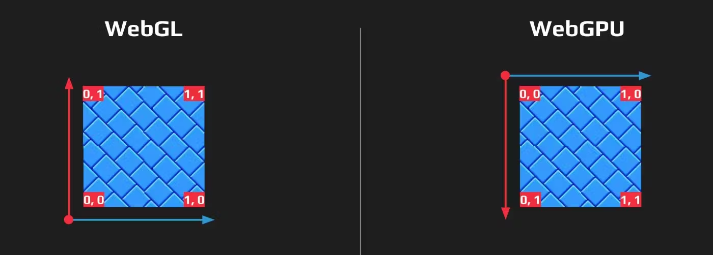
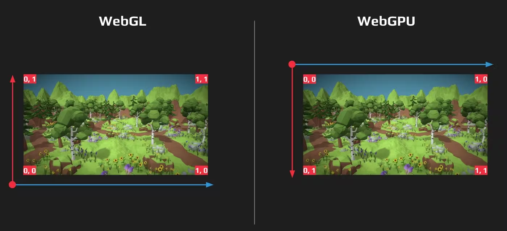
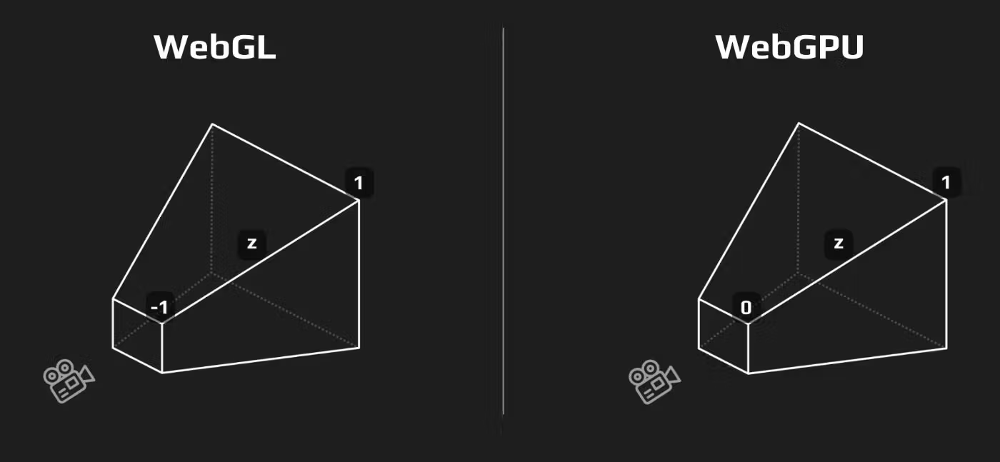
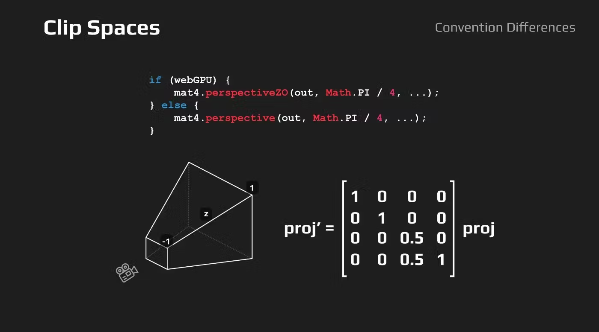

Convention Differences
Textures
After migration, you may encounter a surprise in the form of flipped images.
Those who have ever ported applications from OpenGL to Direct3D (or vice versa) have already faced this classic problem.
In the context of OpenGL and WebGL, textures are usually loaded in such a way that the starting pixel corresponds to the bottom left corner.
However, in practice, many developers load images starting from the top left corner, which leads to the flipped image error.
Nevertheless, this error can be compensated by other factors, ultimately leveling out the problem.

Unlike OpenGL, systems such as Direct3D and Metal traditionally use the upper-left corner as the starting point for textures.
Considering that this approach seems to be the most intuitive for many developers, the creators of WebGPU decided to follow this practice.

Viewport Space
If your WebGL code selects pixels from the frame buffer, be prepared for the fact that WebGPU uses a different coordinate system.
You may need to apply a simple "y = 1.0 - y" operation to correct the coordinates.

Clip Spaces
When a developer faces a problem where objects are clipped or disappear earlier than expected, this is often related to differences in the depth domain.
There's a difference between WebGL and WebGPU in how they define the depth range of the clip space.
While WebGL uses a range from -1 to 1, WebGPU uses a range from 0 to 1, similar to other graphics APIs such as Direct3D, Metal, and Vulkan.
This decision was made due to several advantages of using a range from 0 to 1 that were identified while working with other graphics APIs.

The main responsibility for transforming your model's positions into clip space lies with the projection matrix. The simplest way to adapt your code is to ensure that your projection matrix outputs results in the range of 0 to 1. For those using libraries such as gl-matrix, there is a simple solution: instead of using the perspective function, you can use perspectiveZO; similar functions are available for other matrix operations.


```typescript
if (webGPU) {
// Creates a matrix for a symetric perspective-view frustum
// using left-handed coordinates
mat4.perspectiveZO(out, Math.PI / 4, ...);
} else {
// Creates a matrix for a symetric perspective-view frustum
// based on the default handedness and default near
// and far clip planes definition.
mat4.perspective(out, Math.PI / 4, …);
}
```
However, sometimes you may have an existing projection matrix and you can't change its source. In this case, to transform it into a range from 0 to 1, you can pre-multiply your projection matrix by another matrix that corrects the depth range.


